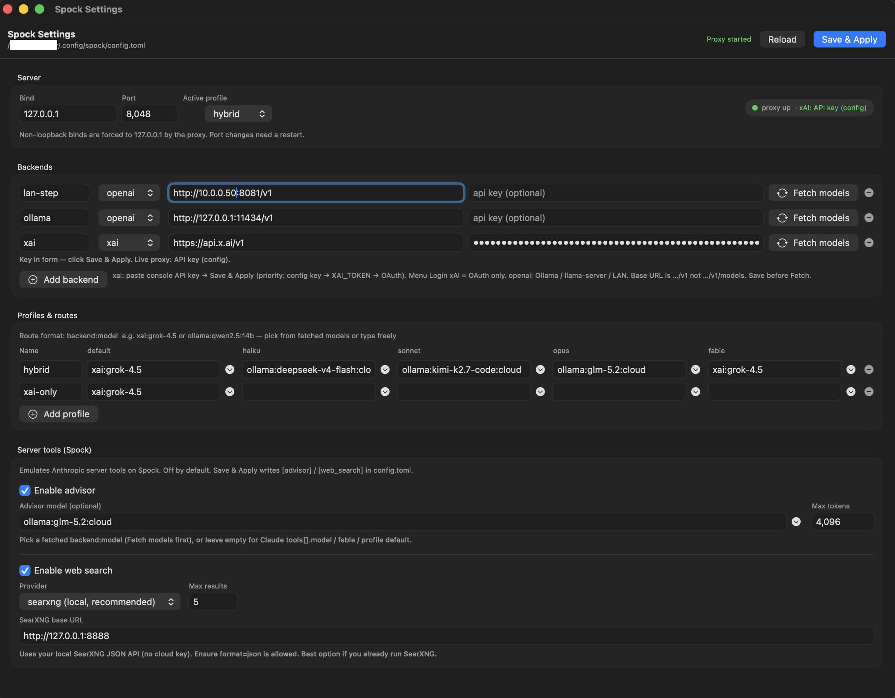

# Spock

**Local multi-backend proxy** that speaks the **Anthropic Messages API** so [Claude Code](https://claude.com/claude-code) (CLI + VSCodium/VS Code) can run on:

- **OAuth providers** — xAI Grok, Kimi Code, optional chat.qwen.ai (`spock login <provider>`)  
- **API Key backends** — Qwen Cloud (qwencloud.com), Ollama / llama-server / OpenRouter / any OpenAI-compatible API  

Claude Code always points at Spock (`http://127.0.0.1:8048`). Spock maps Haiku / Sonnet / Opus / Fable (and any model id) to different backends via profiles — without changing Claude settings when you switch vendors.



| Piece | Role |
|---|---|
| **Spock.app** | macOS menu bar app — proxy, Settings, Chat, profile switch, status icon |
| `spock` CLI | `serve`, `login`, `logout`, `chat`, `status`, `reload` (all platforms) |
| Config | `~/.config/spock/config.toml` |
| OAuth tokens | `~/.config/spock/oauth-<provider>.json` (imports legacy grok-test / kimi paths once) |

---

## Compatible Claude Code versions

Spock is protocol-compatible with Claude Code’s Anthropic Messages client. Versions below were **verified working** with this Spock release (normal chat, tools, streaming, profile routing). Future Claude Code releases can change betas, tool schemas, or streaming and break a proxy — pin or re-test when upgrading.

| Spock | Claude Code CLI | Claude Code IDE extension | Host (example) | Status | Notes |
|---|---|---|---|---|---|
| **0.2.0** | **2.1.207** | **2.1.207** (`cc_version=2.1.207.6dd`) | VSCodium **1.128.0** (also VS Code) | **OK** | Microcompact + mid-SSE errors + log-file + webview text server tools (2026-07-13) |
| **0.2.0** | **2.1.206** | **2.1.206** (`cc_version=2.1.206.87c`) | VSCodium **1.128.0** (also VS Code) | **OK** | Server-tool emulation + presets + Auto Mode reasoning_effort fix (2026-07-13) |
| **0.1.0** | **2.1.206** | **2.1.206** | VSCodium **1.128.0** | **OK** | Baseline Rust multi-backend release (2026-07-11) |

**How to check your versions**

```bash
# Spock
curl -s http://127.0.0.1:8048/health | jq -r .version

# Claude Code CLI
claude --version

# VSCodium / VS Code extension (folder name includes version)
ls -d ~/.vscode-oss/extensions/anthropic.claude-code-* 2>/dev/null
ls -d ~/.vscode/extensions/anthropic.claude-code-* 2>/dev/null
```

If something breaks after a Claude Code upgrade: note **both** Spock and Claude Code versions, re-run the smoke test below, and check [Troubleshooting](#troubleshooting). Prefer matching CLI and extension versions.

**Known limits on the verified stack (not full breakage)**

- Server-tool emulation is **opt-in** via `[advisor]` / `[web_search]` in config (defaults off). Without them, `advisor_20260301` / `web_search_*` schemas are stripped for OpenAI-compat upstreams.
- Advisor runs as a nested review, then comes back as a **text** block (`Advisor review:…`). VSCodium/VS Code 2.1.226 webview has no renderer for `server_tool_use` / `advisor_tool_result` and prints those names as chat lines. Never returned as a client `tool_use` (`No such tool available: advisor`). Pin `[advisor].model` to a **different** route than the executor or the reviewer just continues the agent voice. History that still has the protocol blocks is flattened on the OpenAI-compat path.
- OpenAI Responses API flag exists but is **not implemented** — leave `use_responses_api = false` (Chat Completions).
- Client-side microcompact runs when Claude Code sends `context_management` edits; Anthropic passthrough leaves them for real Anthropic.

---

## Install

### macOS App (recommended)

1. From [Releases](https://github.com/satindergrewal/Spock/releases), download  
   `Spock-VERSION-darwin-arm64.zip` (Apple Silicon) or `…-darwin-x64.zip`
2. Unzip → drag **Spock.app** to **Applications**
3. First launch: right-click → **Open** if Gatekeeper warns (ad-hoc signed until Developer ID is set)
4. Menu bar icon appears (no Dock icon — menu bar agent)
5. **Settings…** — backends + profiles (xAI / Ollama / OpenAI-compat / …). Optional: **Login xAI…** or paste an xAI API key if you use Grok.

Build from source:

```bash
./packaging/macos/build-app.sh   # → dist/Spock.app
open dist/Spock.app
```

### CLI (macOS / Linux / Windows)

```bash
# From a release tarball
tar -xzf spock-VERSION-darwin-arm64.tar.gz
sudo mv spock-VERSION-darwin-arm64/spock /usr/local/bin/

# From source
cargo build --release
# binary: target/release/spock
```

---

## Quick start

```bash
# Option A — macOS app (starts proxy automatically)
open dist/Spock.app   # or Spock from Applications

# Option B — CLI
spock login xai       # Grok subscription (or: kimi / qwen)
spock serve           # http://127.0.0.1:8048
```

Smoke test:

```bash
curl -s http://127.0.0.1:8048/health | jq
curl http://127.0.0.1:8048/v1/messages \
  -H 'content-type: application/json' \
  -d '{"model":"grok-4.5","max_tokens":256,"messages":[{"role":"user","content":"hello"}]}' | jq
```

---

## macOS app

Menu bar only (`LSUIElement` / activation policy `.accessory`):

| Menu | Action |
|---|---|
| Status line | Profile · port · proxy state |
| **Chat…** | Native chat window against the proxy |
| **Settings…** | Full config UI (backends, profiles, routes, API keys) |
| **Profile** | Switch active profile live |
| **Reload config** | Re-read `config.toml` |
| **Login xAI…** / **Logout xAI** | OAuth device flow |
| **Quit Spock** | Stop proxy (if app started it) and exit |

**Status icon color**

| Color | Meaning |
|---|---|
| Green | Proxy healthy |
| Orange | Starting |
| Gray | Stopped |
| Red | Error |

Closing Settings/Chat **does not** quit the app (no Dock icon stuck around). Only **Quit Spock** exits.

**Settings highlights**

- Active profile (persists immediately on change)
- Backends: `xai` or `openai`, base URL, optional API key  
- **Fetch models** — pulls model ids from Ollama (`/v1/models` then `/api/tags`) or xAI  
- Profiles & routes — `backend:model` per role, with dropdowns from fetched models  
- **Save & Apply** — writes TOML and hot-reloads the proxy  

---

## OAuth authentication (xAI, Kimi Code, Qwen Cloud, …)

Providers are registered in Spock (`spock providers`). Each OAuth backend is:

```toml
[backends.xai]
type = "oauth"
provider = "xai"

[backends.kimi]
type = "oauth"
provider = "kimi"

```

Auth priority per OAuth provider (**first wins**):

1. **API key** on that backend (Settings / config) — escape hatch  
2. **Env token** (`XAI_TOKEN`, `KIMI_TOKEN`, …)  
3. **OAuth device login**  
   ```bash
   spock login xai
   spock login kimi
   # menu: Login ▸ xAI / Kimi Code
   ```  
   Tokens: `~/.config/spock/oauth-<provider>.json` (`0600`).

```bash
spock logout xai
spock logout kimi
spock logout --all
```

### Qwen Cloud (qwencloud.com) — API key, not OAuth

[qwencloud.com](https://www.qwencloud.com) has **two paid plans with different hosts and keys**. Neither is chat.qwen.ai OAuth.

| Plan | Key | OpenAI-compatible base | Models (examples) |
|---|---|---|---|
| **Coding Plan** | `sk-sp-…` | `https://coding-intl.dashscope.aliyuncs.com/v1` | Fixed allowlist: `qwen3.7-plus`, `qwen3.6-plus`, `qwen3-coder-plus`, `glm-5`, `kimi-k2.5`, … — **no** `qwen3.8-max-preview` |
| **Token Plan** | separate key (create on Token Plan page) | `https://token-plan.ap-southeast-1.maas.aliyuncs.com/compatible-mode/v1` | Credits catalog incl. **`qwen3.8-max-preview`**, `qwen3.7-max`, … |

```toml
# Coding Plan (sk-sp-…)
[backends.qwen]
type = "api_key"
base_url = "https://coding-intl.dashscope.aliyuncs.com/v1"
api_key_env = "DASHSCOPE_API_KEY"

# Token Plan (for qwen3.8-max-preview) — different key + host:
# [backends.qwen-token]
# type = "api_key"
# base_url = "https://token-plan.ap-southeast-1.maas.aliyuncs.com/compatible-mode/v1"
# api_key = "…"   # from Token Plan page — NOT your Coding Plan sk-sp key
```

1. Create the matching key: [API Keys](https://home.qwencloud.com/api-keys) / [Token Plan](https://home.qwencloud.com/billing/subscription/token-plan)  
2. Paste into Settings or env; **do not mix** Coding Plan keys with the Token Plan host (or vice versa)  
3. Route e.g. Coding: `fable = "qwen:qwen3.7-plus"` · Token: `fable = "qwen-token:qwen3.8-max-preview"`  
4. Reload Spock / Save & Apply  

`/models` only lists what **that plan’s host** exposes. Docs can advertise `qwen3.8-max-preview` while a Coding Plan key’s catalog stays at 10 fixed models — that is upstream plan gating, not Spock.

Optional: `spock login qwen` is the **chat.qwen.ai** OAuth path (qwen-code). Different product again.

### API Key backends (not OAuth)

```toml
[backends.ollama]
type = "api_key"
base_url = "http://127.0.0.1:11434/v1"
```

Platform Moonshot metered keys use `api.moonshot.ai` as `type = "api_key"` — that is separate from **Kimi Code** OAuth (`api.kimi.com/coding/v1`).

---

## Multi-backend routing

Claude Code keeps a single base URL:

```text
ANTHROPIC_BASE_URL=http://127.0.0.1:8048
```

Spock resolves each request’s **model id** using the **active profile**:

```text
exact id override
  → role (haiku / sonnet / opus / fable) if the id contains that word
  → profile default
  → backend:upstream_model
```

There is **no** automatic `grok*` → xAI shortcut. A client id like `grok-4.5[1m]` uses the profile **default** (or a role row if you map it). Context suffixes (`[1m]`, `[500k]`, …) are stripped before the upstream call; Claude Code still sees the original id in responses.

Example (`config.example.toml`):

```toml
[server]
profile = "hybrid"

[backends.xai]
type = "xai"
# api_key = "xai-..."

[backends.ollama]
type = "openai"
base_url = "http://127.0.0.1:11434/v1"

[profiles.hybrid]
default = "ollama:glm-5.2:cloud"
haiku   = "ollama:kimi-k2.7-code:cloud"
sonnet  = "ollama:kimi-k2.7-code:cloud"
opus    = "xai:grok-4.5"
fable   = "ollama:glm-5.2:cloud"
```

| Claude Code sends (examples) | Hybrid row used |
|---|---|
| id containing `haiku` | `haiku` |
| id containing `sonnet` | `sonnet` |
| id containing `opus` | `opus` |
| id containing `fable` | `fable` |
| `grok-4.5[1m]`, other unmatched ids | `default` |

**Tip:** Different backends have different “personalities.” Grok often follows Claude Code’s “you are Claude” system prompt; other models may answer as themselves (or in another language). For a single-brain session, point **default + fable + main roles** at the same `backend:model`.

Many public OpenAI-compatible gateways already work as `type = "openai"` with the right `base_url` + `api_key` (or `api_key_env`). Examples (see [`config.example.toml`](config.example.toml)):

| Backend name | base_url | Key |
|---|---|---|
| OpenRouter | `https://openrouter.ai/api/v1` | `OPENROUTER_API_KEY` or `api_key` |
| OpenAI | `https://api.openai.com/v1` | `OPENAI_API_KEY` |
| DeepSeek | `https://api.deepseek.com` | `DEEPSEEK_API_KEY` |
| Groq | `https://api.groq.com/openai/v1` | `GROQ_API_KEY` |
| LM Studio | `http://127.0.0.1:1234/v1` | optional |

Optional on openai backends:

```toml
api_key_env = "OPENROUTER_API_KEY"
[backends.openrouter.extra_headers]
HTTP-Referer = "https://github.com/satindergrewal/Spock"
X-Title = "Spock"
```

Then route e.g. `default = "openrouter:anthropic/claude-sonnet-4"`. No Claude Code changes required.

Switch profiles live: app menu **Profile**, Settings active profile, or edit TOML + **Reload** / `spock reload`.

Config path: `~/.config/spock/config.toml` (created on first run). Full sample: [`config.example.toml`](config.example.toml).

---

## Claude Code

### Minimal VSCodium / VS Code env

Let Spock own models via the profile (recommended for hybrid):

```json
"claudeCode.environmentVariables": [
  { "name": "ANTHROPIC_BASE_URL", "value": "http://127.0.0.1:8048" },
  { "name": "ANTHROPIC_API_KEY", "value": "xai" },
  { "name": "ANTHROPIC_AUTH_TOKEN", "value": "xai" },
  { "name": "CLAUDE_CODE_AUTO_COMPACT_WINDOW", "value": "500000" },
  { "name": "CLAUDE_AUTOCOMPACT_PCT_OVERRIDE", "value": "90" },
  { "name": "API_TIMEOUT_MS", "value": "3000000" }
]
```

Optional model env overrides (only if you want Claude Code to send fixed ids):

```json
{ "name": "ANTHROPIC_MODEL", "value": "claude-fable-5[1m]" },
{ "name": "ANTHROPIC_DEFAULT_FABLE_MODEL", "value": "claude-fable-5[1m]" },
{ "name": "ANTHROPIC_DEFAULT_OPUS_MODEL", "value": "claude-opus-4-8" },
{ "name": "ANTHROPIC_DEFAULT_SONNET_MODEL", "value": "claude-sonnet-5" },
{ "name": "ANTHROPIC_DEFAULT_HAIKU_MODEL", "value": "claude-haiku-4-5" }
```

Those ids are **role tags** for Spock routing — not necessarily the real upstream model names.

Start a **new** Claude Code session after changing env.

Use a Claude Code version from the [compatible table](#compatible-claude-code-versions) when possible.

### CLI helper

```bash
./claude-grok.sh
```

Starts `spock serve` if needed, sets compact window env, launches `claude`. Override model with `GROK_MODEL_ID` / `ANTHROPIC_MODEL` if you want.

### Context window (~500k for Grok)

- Pair a `[1m]`-flavoured client id with `CLAUDE_CODE_AUTO_COMPACT_WINDOW=500000` so compact math matches Grok’s ~500k window.  
- Spock strips `[1m]` / `[500k]` before calling upstream.  
- Optional: `CLAUDE_AUTOCOMPACT_PCT_OVERRIDE=90`.

### Auto Mode

xAI reasoning models reject OpenAI `stop`. Spock drops `stop` / presence / frequency penalties on **xAI** reasoning routes and keeps them for **Ollama**.  
`GET /v1/models` always includes Claude aliases so Auto Mode does not treat the classifier model as missing.

---

## CLI reference

```text
spock serve [--port N]     Headless proxy on 127.0.0.1 (default 8048)
spock app                  Open Spock.app (macOS)
spock login <provider> [--no-open]   OAuth device login (xai, kimi, qwen, …)
spock logout <provider> | --all
spock providers [--json]
spock chat [prompt] [-m model]
spock status               Profile, backends, auth source, proxy health
spock reload               Re-read config.toml
spock -V | --version
spock help
```

### Environment

| Variable | Default | Purpose |
|---|---|---|
| `PORT` | `8048` | Listen port |
| `GROK_MODEL` | `grok-4.5` | Legacy default / alias helper |
| `GROK_SMALL_MODEL` | = `GROK_MODEL` | Haiku-style alias helper |
| `XAI_TOKEN` | — | xAI API key (skips OAuth if set) |
| `XAI_API_BASE` | `https://api.x.ai/v1` | Upstream override |

---

## HTTP API

### Claude / OpenAI compatible

| Endpoint | Notes |
|---|---|
| `POST /v1/messages` | Anthropic Messages (stream + tools + thinking) |
| `POST /v1/messages/count_tokens` | Rough estimate (chars/4) |
| `POST /v1/chat/completions` | OpenAI-style (raw stream passthrough) |
| `POST /v1/responses` | Search-only (grok-build `web_search`). Runs `[web_search]`; not a general Responses proxy |
| `GET /v1/models` | Merged backend lists + Claude aliases |
| `GET /v1/models/{id}` | Never 404s for aliases |
| `GET /v1/language-models*` | xAI extended list when available |
| `GET /health` | Status, profile, backends, version |

### Local admin (loopback only — used by Spock.app)

| Endpoint | Notes |
|---|---|
| `GET /spock/v1/status` | Profile, auth source, paths |
| `GET /spock/v1/config` | Settings document |
| `PUT /spock/v1/config` | Save & apply full config |
| `POST /spock/v1/profile` | `{"profile":"hybrid"}` |
| `POST /spock/v1/reload` | Reload from disk |
| `POST /spock/v1/logout` | Clear OAuth file |
| `GET /spock/v1/backends/{name}/models` | Discover models (Ollama / xAI) |

---

## Build

```bash
# Tests + headless binary
cargo test
cargo build --release

# macOS app (Rust proxy + SwiftUI shell)
./packaging/macos/build-app.sh
# → dist/Spock.app
```

### Release (GitHub Actions)

Tag `vX.Y.Z` must match `Cargo.toml` `version`. Pushing the tag builds:

- CLI archives: darwin-arm64/x64, linux-x64/arm64, windows-x64  
- macOS App zips: `Spock-VERSION-darwin-arm64.zip` / `…-x64.zip`  
- `checksums.txt` + release notes  

Workflows: [`.github/workflows/ci.yml`](.github/workflows/ci.yml), [`.github/workflows/release.yml`](.github/workflows/release.yml).

---

## Security

- Binds **127.0.0.1 only** — anyone who can reach the port can use your backends  
- OAuth token file `0600` on Unix  
- Do not commit real API keys, LAN IPs, or tokens to public files  
- Admin API is unauthenticated by design (loopback only)  

---

## Troubleshooting

| Symptom | Fix |
|---|---|
| Need proxy logs | App: `tail -f ~/Library/Logs/Spock/spock.log` · CLI: `spock serve --log-file /tmp/spock.log` |
| Upstream quota / 401 in IDE | Settings error banner / `spock status` → `last_err`; fix backend key/credits (not Anthropic login) |
| `401` / SuperGrok / usage on xAI | Check API key, `XAI_TOKEN`, or `spock logout && spock login`; quota on the xAI side |
| Claude opens “log in to Anthropic” | Often a **misread upstream error** — check Spock logs; use a valid key/OAuth; prefer latest Spock (upstream 401 → 502 with clear message) |
| Active profile snaps back in Settings | Use latest app (profile switch persists immediately); Save & Apply |
| Hybrid hits wrong model | Check **active** profile rows; fable/default often drive main chat; empty role fields fall through to default |
| Ollama `*:cloud` fails | Sign in / enable that model in Ollama cloud |
| LAN Fetch models: **No route to host** (os error 65) while Terminal `curl` works | macOS **Local Network** privacy. Rebuild app (`./packaging/macos/build-app.sh` includes `NSLocalNetworkUsageDescription`), **Quit Spock**, reopen. System Settings → Privacy & Security → **Local Network** → enable **Spock**. Or run `spock serve` from Terminal (inherits Terminal’s LAN access). |
| `type = "oauth"` parse error from `dist/Spock.app` | App binary is **old** — rebuild with `./packaging/macos/build-app.sh`; do not hot-copy `spock-proxy` into a signed `.app` |
| Address already in use | `lsof -nP -iTCP:8048` — quit old Spock or Python proxy |
| Gatekeeper blocks app | Right-click → Open |
| Auto Mode “temporarily unavailable” | Upgrade Spock; ensure stop is dropped for xAI reasoning; aliases on `/v1/models` |
| Compacts too early | `CLAUDE_CODE_AUTO_COMPACT_WINDOW=500000` + optional `[1m]` client id |
| Broke after Claude Code update | Compare your CLI/extension versions to the [compatible table](#compatible-claude-code-versions); pin last good extension while Spock is updated |
| xAI / backend quota or 401 in VSCodium | Prefer latest Spock — upstream 401/402/403/429 → **502** with a loud `Spock upstream …` message (not Anthropic login). Check `spock status` / `xai_auth`, credits on console.x.ai, or switch profile |
| `tool_choice set but no tools` | Fixed when tools are stripped (server tools); upgrade Spock |
| Auto Mode “claude-opus-… unavailable” | Often dead **opus** route or (older Spock) `reasoning_effort: none`. Point opus at a live backend; use Spock with the thinking-disabled fix |
| Claude Code `ECONNRESET` / Grok Build `reqwest error stream: error sending request` | Darwin `accept()` used to inherit `O_NONBLOCK` from the listen socket. Rebuild (`./packaging/macos/build-app.sh`) and restart Spock. If it still happens: `spock.log` should now show `route … [openai+stream]` and `spock openai stream: …` instead of a silent drop. Direct LAN vs SSH tunnel is a separate hop. |

Proxy logs each request with the resolved route, e.g.:

```text
  POST /v1/messages
  route claude-fable-5[1m] → ollama:glm-5.2:cloud (openai)
```

---

## Architecture (short)

- **Rust** proxy: minimal deps (`ureq`, `serde`, `toml`), threaded `TcpListener`, Anthropic ↔ OpenAI translation  
- **SwiftUI** macOS shell: menu bar + Settings + Chat; talks to proxy admin API  
- **Profiles** hot-reload without restarting Claude Code  

Python implementation has been removed; this repo is Rust + Swift only.

---

## License

MIT

---

Thanks for using Spock — run Claude Code on the models *you* choose, locally.
